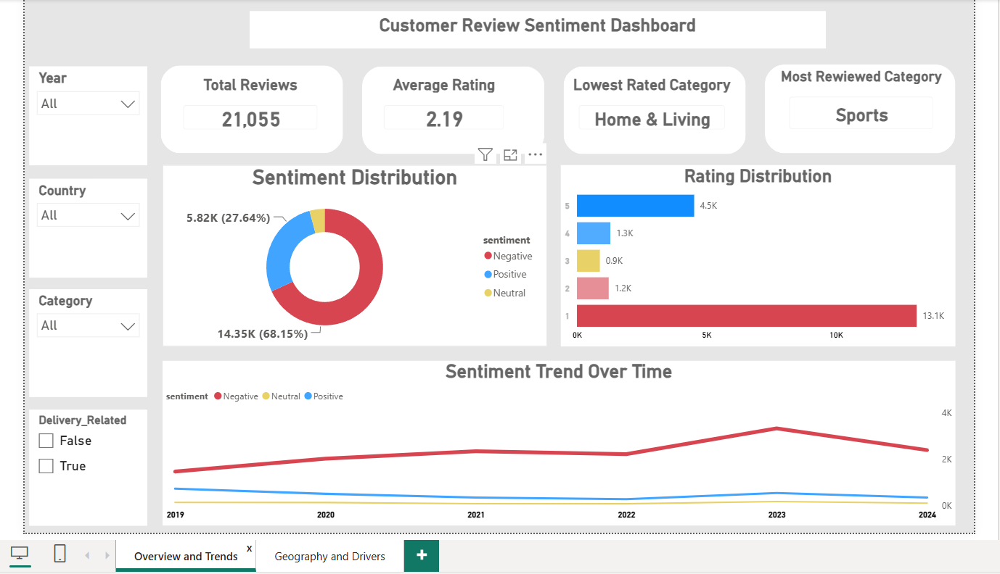
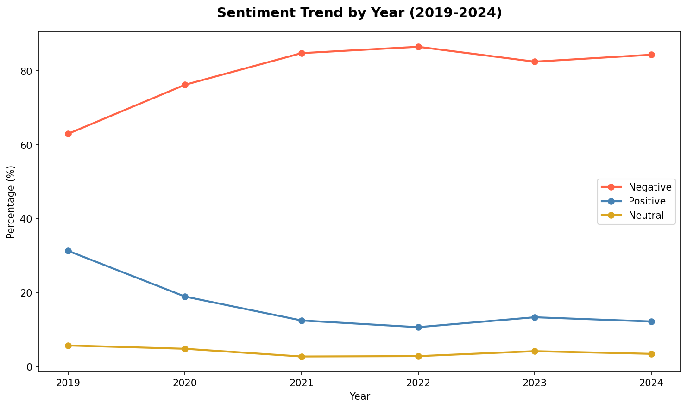
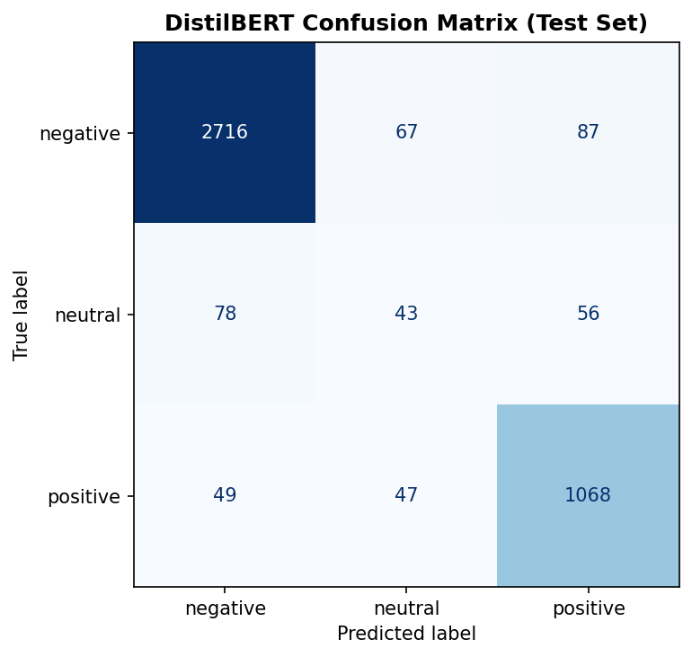

 # ShopEase Europe - Customer Sentiment Analysis

## Executive Summary

Customer reviews are one of the richest sources of business intelligence 
available to any organisation, yet extracting meaningful signal from 
thousands of free-text responses at scale remains a genuine challenge.

This project builds an end-to-end NLP pipeline to automatically classify 
customer sentiment, investigate the operational drivers behind a 
measurable multi-year decline in customer satisfaction, and deliver 
findings through an interactive Power BI dashboard and a live Streamlit 
prediction application.

Built on 21,055 genuine Amazon customer reviews, the project combines 
classical machine learning, DistilBERT fine-tuning, and rigorous 
exploratory analysis to move beyond surface-level sentiment labelling 
toward evidence-based root cause identification.


## Business Problem

ShopEase Europe's customer satisfaction declined significantly between 
2019 and 2022, with negative sentiment rising from 63% to a peak of 87%. 
Understanding what drove that decline, and what operational changes could 
reverse it, requires more than a sentiment classifier. It requires 
analytical instincts applied to the right questions.

This project was designed to:

- Classify customer review sentiment automatically and reliably
- Identify the specific drivers of positive and negative customer 
  experiences through word frequency and trend analysis
- Explore geographic and product-level sentiment patterns across 148 
  countries and 7 product categories
- Deliver actionable business recommendations grounded in evidence, 
  not assumptions

## Project Phases

### Phase 1 - Synthetic Dataset (Discovery & Validation)

The project began with a coordinator-provided dataset of 120,000 customer 
reviews. The full pipeline was completed: data quality assessment, 
cleaning, preprocessing, EDA, and classical NLP modelling.

During model evaluation, both Naive Bayes and Logistic Regression 
achieved a perfect weighted F1-score of 1.0000. Rather than accepting 
this as success, it was treated as a red flag. Investigation revealed 
the dataset was built from only 444 unique template phrases with zero 
overlap between sentiment classes. Models were memorising templates, 
not learning sentiment.

To confirm this, 80 genuine Amazon reviews were sourced from a public 
Hugging Face dataset and used for real-world validation. Performance 
collapsed to approximately 0.48 weighted F1, confirming the synthetic 
dataset's fundamental limitation.

This discovery reinforced a principle that experienced practitioners 
know well: suspiciously perfect results are not a reason to celebrate. 
They are a reason to investigate.

**Phase 1 notebooks:** `notebooks/phase1_initial_dataset/`

### Phase 2 - Real-World Dataset (Production Modelling)

Following this discovery, a genuine dataset of 21,055 Amazon customer 
reviews was sourced for final model development. The dataset was 
confirmed 99% English through language detection, which directly 
informed the decision to use DistilBERT over XLM-RoBERTa. Model 
selection followed the data, not assumptions.

Note: Phase 2 consolidates data cleaning and text preprocessing into 
a single notebook, since the real-world dataset required substantially 
less structural cleaning than the synthetic data.

**Phase 2 notebooks:** `notebooks/phase2_production_dataset/`

### Why This Structure Matters

Phase 1 is retained deliberately. It demonstrates the kind of analytical 
rigour that matters in real data science work: questioning perfect 
results, validating findings against external data, and being willing 
to rebuild from scratch when the data does not hold up. These instincts 
are more valuable than any model score.

## Key Findings

### Sentiment Distribution
68.15% of reviews are negative, 27.64% positive, and just 4.2% neutral. 
Ratings follow a strongly polarised, J-shaped distribution: 62% of all 
reviews are one-star, with very little in the middle ground between 
extreme dissatisfaction and satisfaction.

### Multi-Year Sentiment Decline
Negative sentiment climbed from 63% in 2019 to a peak of 87% in 2022, 
easing to approximately 84% by 2024. The US and GB showed different 
trajectories: US negative sentiment peaked earlier in 2022 before 
partially recovering, while GB overtook the US in 2023 and remained 
elevated through 2024, suggesting distinct underlying causes across 
markets rather than a single shared problem.


### Root Cause Investigation
Word frequency trend analysis between 2019-2020 and 2021-2022 revealed 
delivery operations and driver conduct as the primary driver of the 
decline. "Delivery", "driver", "delivered", and "drivers" showed the 
largest frequency increases of any terms across this period.

Payment and Prime subscription issues were initially suspected given 
their prominence in bigram analysis. This hypothesis was rigorously 
tested against the sentiment trend and ruled out: payment-related 
mentions were already elevated in 2019 before the decline began, and 
decreased over time. Finding the wrong answer and ruling it out is 
as important as finding the right one.

### Geographic Patterns
Review volume is extremely concentrated: US (9,286 reviews) and GB 
(7,294) account for 79% of the dataset. Among the top markets, Canada 
shows the highest negative sentiment at 78%, while Italy stands out 
with a more favourable profile at 41% negative, the only market 
where positive sentiment exceeds negative.

### Class Imbalance
The near-absence of neutral reviews (885 examples, 4.2%) presents a 
genuine modelling challenge that persists across all approaches tested. 
This is a data scarcity problem, not a modelling limitation. Future 
improvement requires additional neutral training examples, not further 
algorithmic tuning.

## Business Recommendations

The following recommendations are derived directly from the analytical findings and are intended to support operational and strategic decision-making.

**Prioritise last-mile delivery operations.** Word frequency trend 
analysis between 2019 and 2022 identified delivery and driver-related 
terms as the primary growing complaint theme, outpacing every other 
category including payment and account issues. ShopEase Europe's 
operations team should audit last-mile delivery partner performance 
and driver conduct as the most evidence-supported lead for reversing 
the multi-year sentiment decline.

**Treat payment issues as a secondary, ongoing concern.** Payment 
and Prime subscription complaints are prevalent and worth addressing, 
but they were present before the decline began and have decreased 
over time. They represent a longstanding baseline issue, not the 
cause of the deterioration between 2019 and 2022.

**Investigate market-specific causes in GB separately from the US.** 
US negative sentiment peaked in 2022 and has partially recovered. 
GB overtook the US in 2023 and remains elevated. A single global 
initiative is unlikely to address both markets effectively. Regional 
root cause analysis, particularly around delivery infrastructure and 
customer service staffing in GB, is warranted.

**Address neutral class data scarcity before the next modelling 
cycle.** Every model tested failed to reliably identify neutral 
sentiment, not because the algorithms are insufficient, but because 
885 training examples cannot adequately represent a genuinely 
ambiguous sentiment class. Sourcing additional neutral-labelled 
reviews should be treated as a data collection priority, not a 
modelling problem to be solved algorithmically.

**Use the delivery-related flag in the dashboard as an operational 
monitoring tool.** 42.4% of all reviews mention delivery-related 
terms, rising to 46.7% among negative reviews. This pre-built filter 
in the Power BI dashboard allows operations teams to isolate and 
monitor delivery-related sentiment in real time without requiring 
additional analysis.

## Model Performance

| Model | Weighted F1 | Neutral F1 | Notes |
|---|---|---|---|
| Naive Bayes | 0.8608 | 0.00 | Never predicts neutral class |
| Logistic Regression (weighted) | 0.8644 | 0.19 | ROC AUC 0.9492 |
| DistilBERT (fine-tuned) | 0.9075 | 0.26 | Selected for production |

Weighted F1 was selected as the primary evaluation metric rather than 
accuracy, given the severe class imbalance. Accuracy of 0.88 on Naive 
Bayes masked complete failure on the neutral class. DistilBERT was 
fine-tuned for 3 epochs on a T4 GPU via Google Colab, with the best 
checkpoint selected based on validation weighted F1.


## Tech Stack

| Layer | Tools |
|---|---|
| Language | Python 3.11 (Anaconda) |
| Data Processing | pandas, numpy |
| NLP & Preprocessing | NLTK, spaCy, TF-IDF (scikit-learn) |
| Classical Modelling | scikit-learn (Naive Bayes, Logistic Regression) |
| Transformer Modelling | Hugging Face Transformers, PyTorch, DistilBERT |
| Training Environment | Google Colab (T4 GPU) |
| Dashboard | Power BI |
| Deployment | Streamlit |
| Model Registry | Hugging Face Hub |
| Version Control | Git, GitHub |

## Workflow

### Phase 1 - Initial Dataset
| Stage | Notebook | Status |
|---|---|---|
| Data Quality Assessment | 01_data_quality_assessment.ipynb | ✅ Complete |
| Data Cleaning Pipeline | 02_data_cleaning_pipeline.ipynb | ✅ Complete |
| Text Preprocessing | 03_text_preprocessing_pipeline.ipynb | ✅ Complete |
| EDA - Sentiment & Category | 04_eda_sentiment_category.ipynb | ✅ Complete |
| EDA - Geographic Sentiment | 05_eda_geographic_sentiment.ipynb | ✅ Complete |
| EDA - Sentiment Drivers | 06_eda_sentiment_drivers.ipynb | ✅ Complete |
| Classical NLP Modelling | 07_classical_nlp_modelling.ipynb | ✅ Complete |
| Real-World Validation | 08_real_world_validation.ipynb | ✅ Complete |

### Phase 2 - Real-World Dataset
| Stage | Notebook | Status |
|---|---|---|
| Data Quality Assessment | 09_data_quality_assessment.ipynb | ✅ Complete |
| Text Preprocessing & Cleaning | 10_text_preprocessing.ipynb | ✅ Complete |
| EDA - Sentiment & Category | 11_eda_sentiment_category.ipynb | ✅ Complete |
| EDA - Geographic Sentiment | 12_eda_geographic_sentiment.ipynb | ✅ Complete |
| EDA - Sentiment Drivers | 13_eda_sentiment_drivers.ipynb | ✅ Complete |
| Classical Modelling | 14_classical_modelling.ipynb | ✅ Complete |
| DistilBERT Fine-Tuning | 15_distilbert_modelling.ipynb | ✅ Complete |
| Dashboard Data Export | 16_dashboard_data_export.ipynb | ✅ Complete |

### Deployment
| Deliverable | Tool | Status |
|---|---|---|
| Interactive Dashboard | Power BI | ✅ Complete |
| Live Sentiment Classifier | Streamlit | ✅ Complete |

## Future Improvements

The current implementation represents a complete end-to-end analytics 
pipeline. Several enhancements would strengthen its suitability for 
production deployment.

**Neutral class performance** remains the most pressing limitation. 
With only 885 neutral examples in the training set, no model tested 
achieved reliable neutral class detection. The most direct fix is 
sourcing additional neutral-labelled reviews. Oversampling techniques 
like SMOTE are a secondary option but unlikely to substitute for 
genuine data diversity at this scale of imbalance.

**Aspect-based sentiment analysis** would move the system beyond 
document-level classification toward identifying which specific 
aspect of a review, delivery, product quality, or customer service, 
is driving the sentiment. Given that our EDA identified delivery 
as the root cause, aspect-based analysis would make that finding 
actionable at the review level rather than the aggregate level.

**Real-time data pipeline** integration would allow the model to 
classify incoming reviews automatically rather than operating on 
a static historical dataset. This would require an API layer 
sitting between the review collection system and the Streamlit app.

**Explainability** using SHAP or LIME would allow non-technical 
stakeholders to understand why the model made a specific prediction, 
addressing the core limitation highlighted throughout this project: 
that a model label alone is insufficient without interpretable 
reasoning behind it.

**Deployment hardening** including Docker containerisation, FastAPI, 
cloud hosting, monitoring, and CI/CD would improve scalability, 
maintainability, and operational readiness for production environments.

## Project Structure

```
shopease-sentiment-analysis/
├── data/
│   ├── raw/              # Original, immutable data (gitignored)
│   ├── processed/        # Cleaned and transformed outputs
│   └── external/         # Third-party validation data
├── notebooks/
│   ├── phase1_initial_dataset/    # Synthetic data — discovery & validation
│   └── phase2_production_dataset/ # Real data — production modelling
├── src/                  # Reusable source modules
├── reports/
│   ├── figures/          # Generated visualisations
│   └── shopease_sentiment_dashboard.pbix
├── models/               # Saved model artifacts (gitignored)
├── streamlit_app.py      # Live sentiment classifier
├── config.yaml
└── requirements.txt
```

## Setup & Installation

```bash
# Clone the repository
git clone https://github.com/Aishahbooks/shopease-sentiment-analysis.git
cd shopease-sentiment-analysis

# Install dependencies
pip install -r requirements.txt

# Launch the Streamlit application
streamlit run streamlit_app.py
```

The fine-tuned DistilBERT model is hosted on Hugging Face Hub at 
`AishatOlisa/shopease-sentiment-distilbert` and loads automatically 
at runtime. No manual model download required.

## About 

**Aishat Olisa-Samson**
Data Scientist focused on Machine Learning, Decision Analytics, and 
transforming data into actionable business insight.

- LinkedIn: https://www.linkedin.com/in/aishat-olisa-samson-0266122a0
- Hugging Face: https://huggingface.co/AishatOlisa

